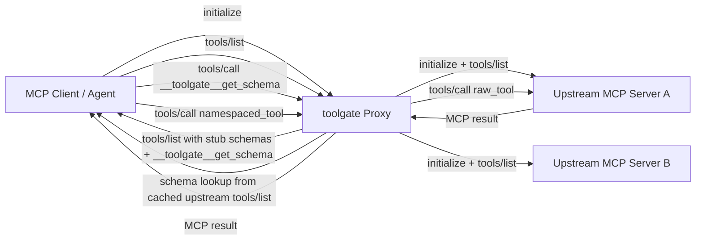

# toolgate — architecture and design

This document describes why **toolgate** exists, what it does at a high level, how the pieces fit together, and where the project may go next. For how to run tests and benchmarks, see [BENCHMARKS_AND_TESTS.md](./BENCHMARKS_AND_TESTS.md).

---

## 1. Purpose and motivation

### 1.1 Problem

Agents that use the [Model Context Protocol (MCP)](https://modelcontextprotocol.io) often connect to **many MCP servers**, each exposing **many tools**. A standard MCP `tools/list` response can include **full JSON schemas** for every tool. When that list is injected into the model context (system prompt or tool definitions), **token usage grows quickly**—often with little benefit for early reasoning steps where the model only needs to know **what tools exist** and **roughly what they do**.

### 1.2 Idea

**toolgate** is a **Python middleware library** that sits between your agent and one or more MCP servers. It presents tool information in **stages**:

| Stage | What the agent gets | Typical use |
|-------|---------------------|-------------|
| **Stage 1** | Lightweight **tool briefs**: name, description, whether parameters are required, optional full schema if not staged | Discovery, planning, “which tool should I use?” |
| **Stage 2** | Full **input schemas** for a **subset** of tools by name | Building correct arguments before a call |
| **Stage 3** | **Tool execution** (`tools/call`) with resolved arguments | Same as raw MCP |

The default mode (**`staged=True`**) keeps Stage 1 small by **omitting** full `inputSchema` blobs from the brief list; the caller fetches schemas **on demand** via Stage 2. Servers can opt into **`staged=False`** to behave like a traditional full list in Stage 1 (useful for comparisons or small registries).

### 1.3 Non-goals

- **Not** a replacement for the MCP protocol or a hosted MCP gateway.
- **Not** opinionated about how the LLM formats prompts; toolgate provides **data** (`ToolBrief`, `ToolSchema`, `ToolResult`) and **string helpers** (e.g. `list_tools_text()`).
- **Not** required to use Node.js; optional npm tooling exists for **examples** and **discovery** of locally installed npm MCP packages.

---

## 2. High-level architecture


- **`ToolGate`**: Orchestrates lifecycle, **server registration**, **Stage 1–3** APIs, and **refresh** after tool list changes.
- **`ServerHandle`**: One MCP server **process or URL**, caches **raw tool list** and **schemas**, builds **`ToolBrief`** instances, executes **calls**.
- **`ToolRegistry`**: Global **namespaced tool name → `server_id`** map with **collision detection** and **fuzzy suggestions** on missing names.
- **`MCPConnection`**: Transport abstraction — **`StdioConnection`** (subprocess JSON-RPC) and **`HTTPConnection`** (remote) implement the same contract.

---

## 3. Pipeline DFD (end-to-end)

### 3.1 Data-flow view



### 3.2 Pipeline steps

1. Client initializes `toolgate` proxy with JSON-RPC `initialize`.
2. Proxy initializes upstream servers and caches their `tools/list`.
3. Client requests `tools/list`; proxy returns namespaced tools with stub `inputSchema` plus `__toolgate__get_schema`.
4. Client requests full schema only for selected tools via `tools/call` on `__toolgate__get_schema`.
5. Client executes real tool with `tools/call`; proxy routes by namespaced tool name and returns upstream result.

### 3.3 Raw JSON-RPC examples: native MCP vs toolgate

#### A) `tools/list` from a native MCP server (full schema upfront)

```json
{"jsonrpc":"2.0","id":2,"method":"tools/list","params":{}}
```

```json
{
  "jsonrpc": "2.0",
  "id": 2,
  "result": {
    "tools": [
      {
        "name": "browser_navigate",
        "description": "Navigate to URL",
        "inputSchema": {
          "type": "object",
          "properties": {
            "url": { "type": "string", "format": "uri" }
          },
          "required": ["url"]
        }
      }
    ]
  }
}
```

#### B) `tools/list` from toolgate proxy (brief + stub schema)

```json
{"jsonrpc":"2.0","id":2,"method":"tools/list","params":{}}
```

```json
{
  "jsonrpc": "2.0",
  "id": 2,
  "result": {
    "tools": [
      {
        "name": "playwright__browser_navigate",
        "description": "Navigate to URL (call __toolgate__get_schema to get parameters before use)",
        "inputSchema": {
          "type": "object",
          "properties": {},
          "additionalProperties": true
        }
      },
      {
        "name": "__toolgate__get_schema",
        "description": "Returns the full parameter schema for any upstream tool.",
        "inputSchema": {
          "type": "object",
          "properties": {
            "tool_name": { "type": "string" }
          },
          "required": ["tool_name"]
        }
      }
    ]
  }
}
```

#### C) Stage 2 schema fetch via toolgate

```json
{
  "jsonrpc":"2.0",
  "id":3,
  "method":"tools/call",
  "params":{
    "name":"__toolgate__get_schema",
    "arguments":{"tool_name":"playwright__browser_navigate"}
  }
}
```

```json
{
  "jsonrpc":"2.0",
  "id":3,
  "result":{
    "content":[
      {
        "type":"text",
        "text":"{\"type\":\"object\",\"properties\":{\"url\":{\"type\":\"string\",\"format\":\"uri\"}},\"required\":[\"url\"]}"
      }
    ],
    "isError": false
  }
}
```

#### D) Stage 3 tool execution via toolgate

```json
{
  "jsonrpc":"2.0",
  "id":4,
  "method":"tools/call",
  "params":{
    "name":"playwright__browser_navigate",
    "arguments":{"url":"https://example.com"}
  }
}
```

```json
{
  "jsonrpc":"2.0",
  "id":4,
  "result":{
    "content":[{"type":"text","text":"..."}],
    "isError": false
  }
}
```

---

## 4. Core concepts

### 4.1 Staged vs full discovery

- **`staged=True`** (default): After `tools/list`, each tool becomes a **`ToolBrief`** with **name**, **description**, **`requires_params`**, and **no** `full_schema` (unless you attach later). Full schemas are retrieved through **`get_schemas([...])`** which reads from the handle’s cache (populated from the same `tools/list` data—no extra network round for “fetch schema” in the common case; the **separation** is about **what you expose to the model**).
- **`staged=False`**: Stage 1 includes **`full_schema`** on each brief so the agent can behave like a full-schema client in one shot.

`requires_params` is **True** when the tool’s `inputSchema` has **non-empty** `properties`; empty object schemas are treated as **no-parameter** tools for labeling.

### 4.2 Namespacing

When **`namespace=True`** (default), tool names exposed to the agent are **`{server_id}__{raw_tool_name}`** (e.g. `playwright__browser_navigate`). This avoids collisions when multiple servers define the same raw name. **`namespace=False`** passes raw names through and relies on the registry to catch duplicates.

### 4.3 Registry and routing

`ToolRegistry` registers every namespaced name after **`ToolGate.start()`** loads tools. **`call(tool_name, …)`** and **`get_schemas([...])`** **resolve** the name to a **`ServerHandle`** via the registry. **`ToolNotFoundError`** includes a **Levenshtein-based** suggestion when close matches exist; **`ToolCollisionError`** is raised if registration would duplicate a name.

### 4.4 Lifecycle

1. **`add_server(...)`** — register servers (stdio command or **URL** for HTTP) **before** `start()`.
2. **`start()`** — connect each server, run MCP **initialize**, **list tools**, fill caches, register tools.
3. **`list_tools()`** / **`get_schemas()`** / **`call()`** — staged usage.
4. **`refresh(server_id?)`** — reload tools for one or all servers; **rebuilds** registry entries and clears Stage 1 cache.
5. **`stop()`** — closes connections.

**`SyncToolGate`** wraps the async API with a **dedicated event loop** for synchronous callers.

---

## 5. Module map (source layout)

| Area | Role |
|------|------|
| `core.py` | **`ToolGate`** orchestrator |
| `server.py` | **`ServerHandle`** — per-server cache, briefs, `get_schema`, `call_tool` |
| `registry.py` | **`ToolRegistry`** — name → server, collisions, suggestions |
| `types.py` | **`ToolBrief`**, **`ToolSchema`**, **`ToolResult`** |
| `errors.py` | Typed errors for startup, tools, timeouts, schema fetch |
| `connection/` | **`MCPConnection`** ABC, **`stdio`**, **`http`** |
| `sync.py` | **`SyncToolGate`** blocking facade |
| `node_discovery.py` | Map **`package.json`** deps + **`node_modules`** to known npm MCP entrypoints; **`DEFAULT_NODE_MCP_REGISTRY`** |
| `proxy/` | **Proxy MCP server** — wraps upstream servers, exposes stub schemas at Stage 1 + `__toolgate__get_schema` tool |
| `setup/` | macOS **CLI** to discover local/global Node MCPs and **preview/apply** Claude/Cursor MCP config |
| `cli.py` | **`toolgate`** entrypoint (`setup`, `proxy` subcommands) |

---

## 6. Transport layer

- **Stdio**: Spawns **`command`** as a subprocess, speaks **JSON-RPC** over stdin/stdout per MCP streamable HTTP–style framing used by MCP stdio, with timeouts and error translation (`ServerStartError`, `ServerCrashedError`, `ToolTimeoutError`).
- **HTTP**: Optional remote transport (`url=`) — loaded lazily in `ServerHandle` to avoid import cycles; intended for MCP-over-HTTP deployments.

Protocol version and client metadata are set in the stdio client (see `connection/stdio.py`).

---

## 7. CLI and setup tooling (macOS)

The **`toolgate setup`** command **discovers** MCP servers from:

- project **`node_modules`** (via `discover_node_mcp_servers` and related logic), and  
- **global npm** (`npm root -g`).

It then **detects** supported apps (e.g. Claude, Cursor) and can **preview or apply** configuration changes. This is **orthogonal** to the core **`ToolGate`** library: same **discovery** building blocks, different **product** surface (developer ergonomics).

**`--mode proxy`** is reserved for future work; v1 supports **direct** wiring only.

---

## 8. Failure modes (summary)

- **Start failures**: bad binary, missing executable → `ServerStartError`.
- **Process death**: `ServerCrashedError`.
- **Unknown tool**: `ToolNotFoundError` with optional suggestion.
- **Name clash**: `ToolCollisionError`.
- **Tool returned error** flag: `ToolExecutionError` raised from **`call_tool`** when MCP marks an error result.
- **Schema missing** when resolving: `SchemaFetchError`.

---

## 9. Benchmark results

Measured on 8 workflow profiles across 3 servers (playwright, wiki, memory — 32 namespaced tools). Full data: [BENCHMARKS_AND_TESTS.md](./BENCHMARKS_AND_TESTS.md).

| Metric | Value |
|--------|-------|
| Naive full-registry prompt (~tokens) | ~6,343 |
| Strip staged workflow (~tokens) | ~861 |
| **Mean token reduction** | **6.4× fewer** (range: 5.2×–7.5×) |
| Schema fetch overhead | ~0 ms (in-process cache) |
| Startup overhead vs full | ~12 ms mean |

Token counts use `len(utf8_text) // 4` — a proxy, not a vendor tokenizer. Use for ratios and deltas.

---

## 10. Future direction

| Direction | Notes |
|-----------|--------|
| **Proxy mode** | Implemented: `toolgate proxy --config` runs toolgate as an MCP proxy in front of upstream servers (see `src/toolgate/proxy/`). `--mode proxy` in the setup CLI remains reserved. |
| **HTTP transport** | `url=` path exists; maturity and parity with stdio (reconnect, auth) may grow over time. |
| **Discovery** | Expand **`DEFAULT_NODE_MCP_REGISTRY`** or pluggable registries as the npm MCP ecosystem grows. |
| **Docs** | This file is the **canonical** architecture overview; older design filenames may appear in git history. |

---

## 11. Related reading

- [README.md](../README.md) — quick start, repo layout, setup CLI usage
- [CONTRIBUTING.md](../CONTRIBUTING.md) — Python vs optional Node tooling
- [BENCHMARKS_AND_TESTS.md](./BENCHMARKS_AND_TESTS.md) — benchmarks (results, scripts, methodology) and pytest suite

---

## 12. Glossary

| Term | Meaning |
|------|--------|
| **Stage 1 / 2 / 3** | Brief list → full schemas for selected tools → execute tool |
| **Brief** | `ToolBrief` — minimal tool metadata for discovery |
| **Namespaced name** | `server_id__tool_name` when namespacing is on |
| **Staged** | Omit full schemas from Stage 1 briefs; fetch via Stage 2 |
