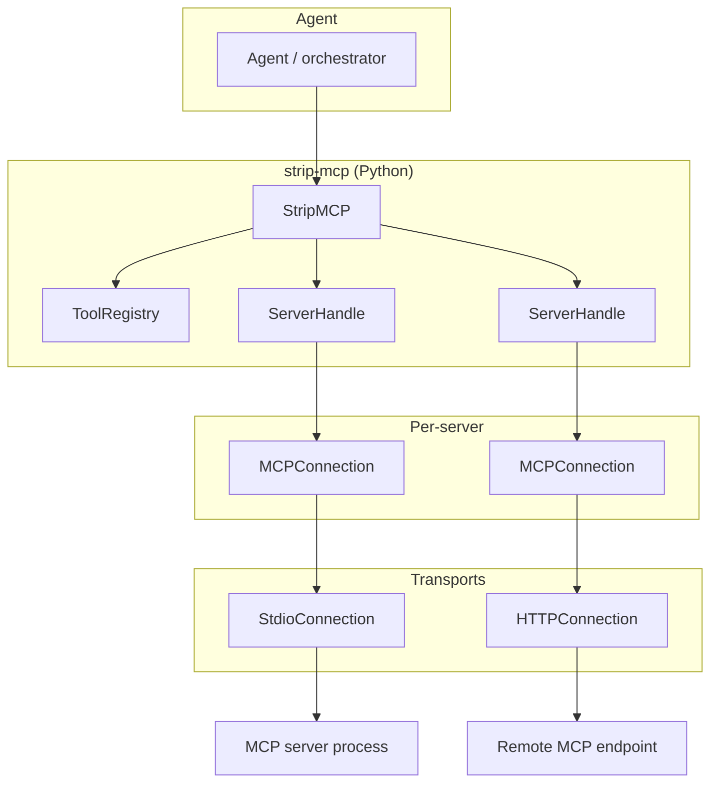

# strip-mcp — architecture and design

This document describes why **strip-mcp** exists, what it does at a high level, how the pieces fit together, and where the project may go next. For how to run tests and benchmarks, see [BENCHMARKS_AND_TESTS.md](BENCHMARKS_AND_TESTS.md).

---

## 1. Purpose and motivation

### 1.1 Problem

Agents that use the [Model Context Protocol (MCP)](https://modelcontextprotocol.io) often connect to **many MCP servers**, each exposing **many tools**. A standard MCP `tools/list` response can include **full JSON schemas** for every tool. When that list is injected into the model context (system prompt or tool definitions), **token usage grows quickly**—often with little benefit for early reasoning steps where the model only needs to know **what tools exist** and **roughly what they do**.

### 1.2 Idea

**strip-mcp** is a **Python middleware library** that sits between your agent and one or more MCP servers. It presents tool information in **stages**:

| Stage | What the agent gets | Typical use |
|-------|---------------------|-------------|
| **Stage 1** | Lightweight **tool briefs**: name, description, whether parameters are required, optional full schema if not staged | Discovery, planning, “which tool should I use?” |
| **Stage 2** | Full **input schemas** for a **subset** of tools by name | Building correct arguments before a call |
| **Stage 3** | **Tool execution** (`tools/call`) with resolved arguments | Same as raw MCP |

The default mode (**`staged=True`**) keeps Stage 1 small by **omitting** full `inputSchema` blobs from the brief list; the caller fetches schemas **on demand** via Stage 2. Servers can opt into **`staged=False`** to behave like a traditional full list in Stage 1 (useful for comparisons or small registries).

### 1.3 Non-goals

- **Not** a replacement for the MCP protocol or a hosted MCP gateway.
- **Not** opinionated about how the LLM formats prompts; strip-mcp provides **data** (`ToolBrief`, `ToolSchema`, `ToolResult`) and **string helpers** (e.g. `list_tools_text()`).
- **Not** required to use Node.js; optional npm tooling exists for **examples** and **discovery** of locally installed npm MCP packages.

---

## 2. High-level architecture

- **`StripMCP`**: Orchestrates lifecycle, **server registration**, **Stage 1–3** APIs, and **refresh** after tool list changes.
- **`ServerHandle`**: One MCP server **process or URL**, caches **raw tool list** and **schemas**, builds **`ToolBrief`** instances, executes **calls**.
- **`ToolRegistry`**: Global **namespaced tool name → `server_id`** map with **collision detection** and **fuzzy suggestions** on missing names.
- **`MCPConnection`**: Transport abstraction — **`StdioConnection`** (subprocess JSON-RPC) and **`HTTPConnection`** (remote) implement the same contract.

---

## 3. Core concepts

### 3.1 Staged vs full discovery

- **`staged=True`** (default): After `tools/list`, each tool becomes a **`ToolBrief`** with **name**, **description**, **`requires_params`**, and **no** `full_schema` (unless you attach later). Full schemas are retrieved through **`get_schemas([...])`** which reads from the handle’s cache (populated from the same `tools/list` data—no extra network round for “fetch schema” in the common case; the **separation** is about **what you expose to the model**).
- **`staged=False`**: Stage 1 includes **`full_schema`** on each brief so the agent can behave like a full-schema client in one shot.

`requires_params` is **True** when the tool’s `inputSchema` has **non-empty** `properties`; empty object schemas are treated as **no-parameter** tools for labeling.

### 3.2 Namespacing

When **`namespace=True`** (default), tool names exposed to the agent are **`{server_id}__{raw_tool_name}`** (e.g. `playwright__browser_navigate`). This avoids collisions when multiple servers define the same raw name. **`namespace=False`** passes raw names through and relies on the registry to catch duplicates.

### 3.3 Registry and routing

`ToolRegistry` registers every namespaced name after **`StripMCP.start()`** loads tools. **`call(tool_name, …)`** and **`get_schemas([...])`** **resolve** the name to a **`ServerHandle`** via the registry. **`ToolNotFoundError`** includes a **Levenshtein-based** suggestion when close matches exist; **`ToolCollisionError`** is raised if registration would duplicate a name.

### 3.4 Lifecycle

1. **`add_server(...)`** — register servers (stdio command or **URL** for HTTP) **before** `start()`.
2. **`start()`** — connect each server, run MCP **initialize**, **list tools**, fill caches, register tools.
3. **`list_tools()`** / **`get_schemas()`** / **`call()`** — staged usage.
4. **`refresh(server_id?)`** — reload tools for one or all servers; **rebuilds** registry entries and clears Stage 1 cache.
5. **`stop()`** — closes connections.

**`SyncStripMCP`** wraps the async API with a **dedicated event loop** for synchronous callers.

---

## 4. Module map (source layout)

| Area | Role |
|------|------|
| `core.py` | **`StripMCP`** orchestrator |
| `server.py` | **`ServerHandle`** — per-server cache, briefs, `get_schema`, `call_tool` |
| `registry.py` | **`ToolRegistry`** — name → server, collisions, suggestions |
| `types.py` | **`ToolBrief`**, **`ToolSchema`**, **`ToolResult`** |
| `errors.py` | Typed errors for startup, tools, timeouts, schema fetch |
| `connection/` | **`MCPConnection`** ABC, **`stdio`**, **`http`** |
| `sync.py` | **`SyncStripMCP`** blocking facade |
| `node_discovery.py` | Map **`package.json`** deps + **`node_modules`** to known npm MCP entrypoints; **`DEFAULT_NODE_MCP_REGISTRY`** |
| `setup/` | macOS **CLI** to discover local/global Node MCPs and **preview/apply** Claude/Cursor MCP config |
| `cli.py` | **`strip-mcp`** entrypoint (`setup` subcommand, etc.) |

**`adapters/`** exists for host-specific integration hooks as the setup path evolves.

---

## 5. Transport layer

- **Stdio**: Spawns **`command`** as a subprocess, speaks **JSON-RPC** over stdin/stdout per MCP streamable HTTP–style framing used by MCP stdio, with timeouts and error translation (`ServerStartError`, `ServerCrashedError`, `ToolTimeoutError`).
- **HTTP**: Optional remote transport (`url=`) — loaded lazily in `ServerHandle` to avoid import cycles; intended for MCP-over-HTTP deployments.

Protocol version and client metadata are set in the stdio client (see `connection/stdio.py`).

---

## 6. CLI and setup tooling (macOS)

The **`strip-mcp setup`** command **discovers** MCP servers from:

- project **`node_modules`** (via `discover_node_mcp_servers` and related logic), and  
- **global npm** (`npm root -g`).

It then **detects** supported apps (e.g. Claude, Cursor) and can **preview or apply** configuration changes. This is **orthogonal** to the core **`StripMCP`** library: same **discovery** building blocks, different **product** surface (developer ergonomics).

**`--mode proxy`** is reserved for future work; v1 supports **direct** wiring only.

---

## 7. Failure modes (summary)

- **Start failures**: bad binary, missing executable → `ServerStartError`.
- **Process death**: `ServerCrashedError`.
- **Unknown tool**: `ToolNotFoundError` with optional suggestion.
- **Name clash**: `ToolCollisionError`.
- **Tool returned error** flag: `ToolExecutionError` raised from **`call_tool`** when MCP marks an error result.
- **Schema missing** when resolving: `SchemaFetchError`.

---

## 8. Future direction and roadmap

These items are **directional**; not all are committed or scheduled.

| Direction | Notes |
|-----------|--------|
| **Proxy mode** | CLI documents `--mode proxy` as reserved: a future mode could run strip-mcp as an MCP **proxy** in front of backends instead of only editing app configs. |
| **HTTP transport** | `url=` path exists; maturity and parity with stdio (reconnect, auth) may grow over time. |
| **Discovery** | Expand **`DEFAULT_NODE_MCP_REGISTRY`** or pluggable registries as the npm MCP ecosystem grows; keep **setup** and **runtime** discovery aligned. |
| **Benchmarks** | Continue to measure **token / latency** tradeoffs for staged vs full-schema in `examples/` (see [BENCHMARKS_AND_TESTS.md](BENCHMARKS_AND_TESTS.md)). |
| **Docs** | This file is the **canonical** architecture overview; older design filenames may appear in git history. |

---

## 9. Related reading

- [README.md](../README.md) — quick start, repo layout, setup CLI usage  
- [CONTRIBUTING.md](../CONTRIBUTING.md) — Python vs optional Node tooling  
- [BENCHMARKS_AND_TESTS.md](BENCHMARKS_AND_TESTS.md) — tests and benchmark scripts  

---

## 10. Glossary

| Term | Meaning |
|------|--------|
| **Stage 1 / 2 / 3** | Brief list → full schemas for selected tools → execute tool |
| **Brief** | `ToolBrief` — minimal tool metadata for discovery |
| **Namespaced name** | `server_id__tool_name` when namespacing is on |
| **Staged** | Omit full schemas from Stage 1 briefs; fetch via Stage 2 |
